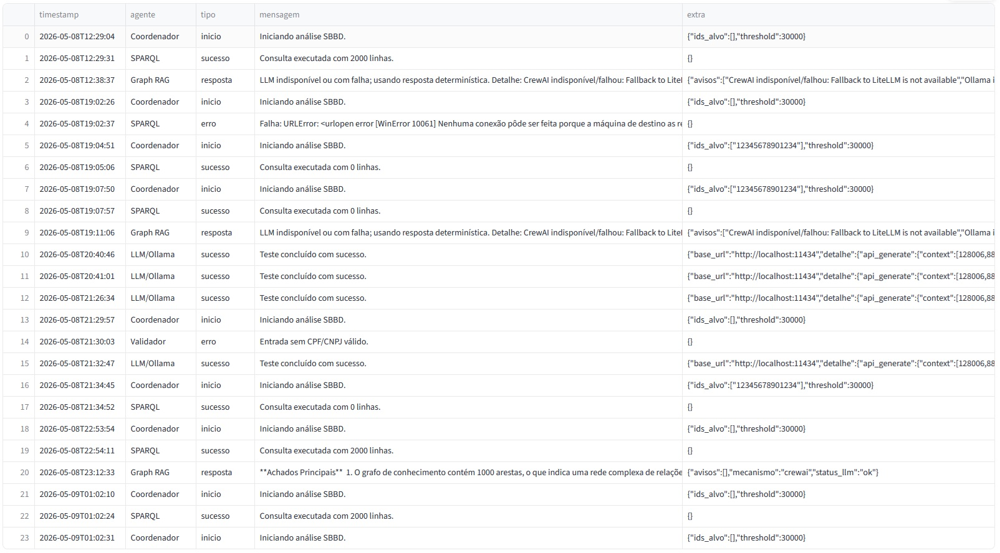
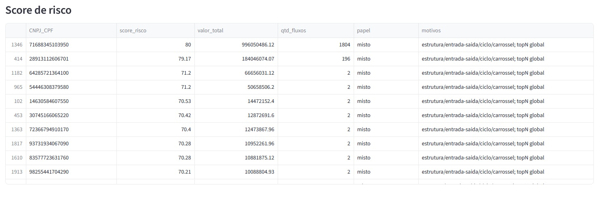
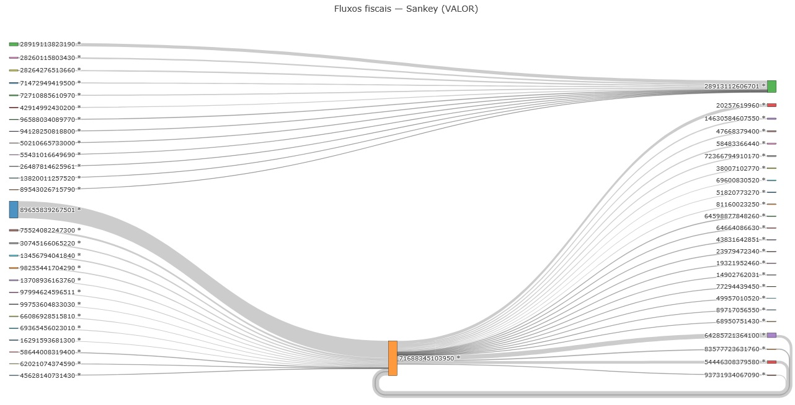

## PFKG-LLM: Exploração Guiada de Dados Fiscais em Larga Escala com Grafos de Conhecimento e LLMs

Utiliza Agentes LLM locais desenvolvidos em CrewAI e Ollama, para exploração guiada em larga escala 
em Grafos de Conhecimentos Fiscais (Fiscal Knowledge Graph).

A seleção de quais empresas têm indícios de irregularidade, em ambiente de Big Data, com milhões de
Documentos Fiscais eletrônicos dos últimos 5 anos de milhares de empresas podem chegar na faixa de 
bilhões de dados corresponde a procurar uma agulha no palheiro. 


Neste cenário, Agentes LLM, a partir de demandas em linguagem natural conseguem transformar a 
requisição em consultas SPARQL, aplicar sobre os dados do triplestore e identificar quais são as
candidatas para aprofundamento dos estudos.

Exemplo de Conversa dos Agentes Relacionados


Resultados da Interação entre os Agentes





## Vídeos Associados:

https://github.com/mariano-roberval/PFKG-LLM/blob/main/Aba_Execucao_Analise_e_Consulta-Sem_lista_de_CNPJ.mp4

https://github.com/mariano-roberval/PFKG-LLM/blob/main/Aba_Execucao_Analise_e_Consulta.mp4

https://github.com/mariano-roberval/PFKG-LLM/blob/main/Aba_Dashboard_SBBD.mp4

https://github.com/mariano-roberval/PFKG-LLM/blob/main/Aba_de_Configuracao_com_o_botao_de_testar_Agentes_Ollama.mp4

https://github.com/mariano-roberval/PFKG-LLM/blob/main/Aba_Graph_RAG.mp4


## Execução local

1. Instale Python 3.11+.
2. Instale e execute o GraphDB em `http://localhost:7202`.
3. Crie o repositório `KG_EFD_Demo`.
4. Importe `sample_data/KG_EFD_Demo_sample.trig`, de https://github.com/mariano-roberval/KG_EFD_Demo
5. Instale dependências:

```bash
python -m venv .venv
.venv\Scripts\activate
pip install -r requirements.txt
copy config.example.json config.json
streamlit run app_identificador_de_candidatos.py
